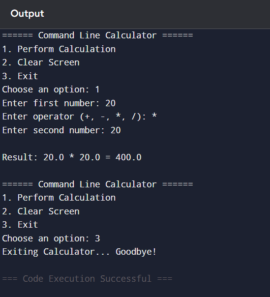

# Command Line Calculator (Python)

## Overview

This project is a **menu-driven command-line calculator** developed using Python.
It performs basic arithmetic operations while demonstrating **clean code structure**, **input validation**, and **exception handling**.

The application allows users to repeatedly perform calculations, clear the screen, or exit the program.

---

## Features

* Perform arithmetic operations:

  * Addition (+)
  * Subtraction (−)
  * Multiplication (×)
  * Division (÷)
* Menu-based interaction
* Continuous calculations without restarting
* Input validation for numeric values
* Divide-by-zero error handling
* Modular function-based design
* Simple clear-screen functionality

---

## Technologies Used

* Python 3
* Command Line Interface (CLI)

---

## Project Structure

```
calculator-project/
│
├── calculator.py
└── README.md
```

---

## How to Run

### 1️⃣ Install Python

Check Python installation:

```
python --version
```

---

### 2️⃣ Run the Program

```
python calculator.py
```

---

## Program Menu

```
====== Command Line Calculator ======
1. Perform Calculation
2. Clear Screen
3. Exit
```

### Menu Options

**1 — Perform Calculation**

* Enter two numbers
* Select operator (+, -, *, /)
* Displays calculated result

**2 — Clear Screen**

* Prints blank lines to simulate clearing previous calculations

**3 — Exit**

* Terminates the calculator program

---

## Function Breakdown

### Calculation Functions

* `add(a, b)` → Returns sum
* `subtract(a, b)` → Returns difference
* `multiply(a, b)` → Returns product
* `divide(a, b)` → Performs division with zero-check

### Utility Functions

* `clear_screen()` → Clears previous output visually
* `get_number(prompt)` → Validates numeric user input
* `perform_calculation()` → Handles operator selection and execution

### Control Functions

* `show_menu()` → Displays calculator menu
* `main()` → Runs program loop until exit

---

## Error Handling

The program safely handles:

* Invalid number inputs
* Unsupported operators
* Division by zero

Example:

```
Cannot divide by zero
```

---

## Learning Objectives

This project demonstrates:

* Python functions
* Exception handling
* User input validation
* Loop control
* Modular program design
* CLI application development

---

## Future Enhancements

* True terminal clearing using OS commands
* Calculation history tracking
* Save results to file
* Unit testing support
* GUI version using Tkinter
* Docker deployment

---


